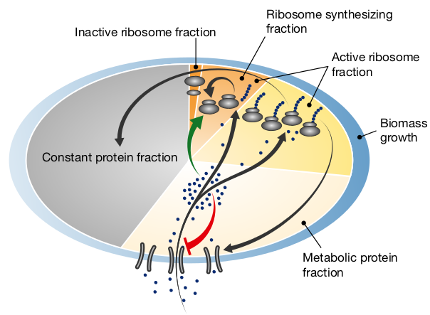
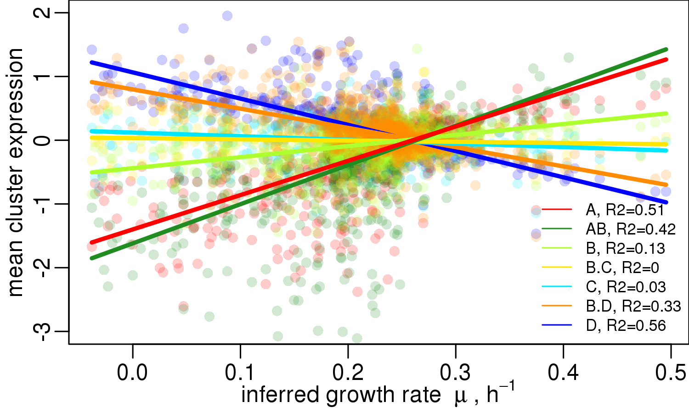
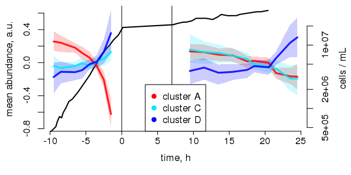
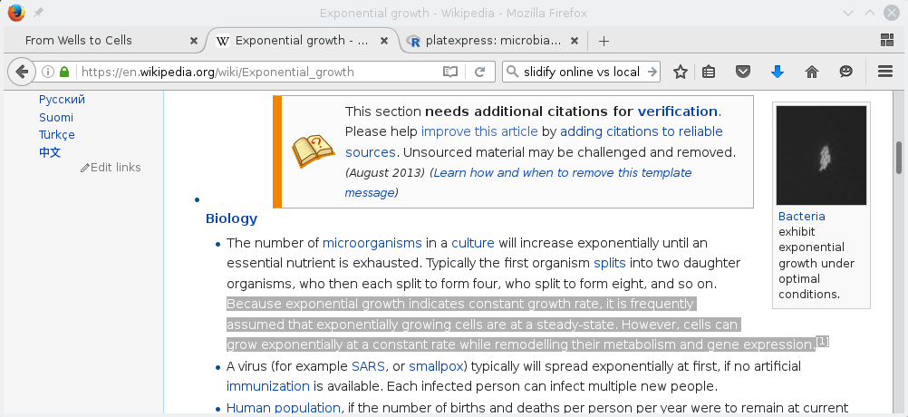

---
## Why Platereader?

### Shakeflask vs. Platereader Cultures

1. Data Analysis
    * many replicates, many conditions
	* different statistics required
2. Endpoint vs. Kinetics
    * steady-state vs. dynamics

<oq>Are tube and platereader cultures comparable?</oq> 
<oq>Why Timeseries?</oq> 
<oq>Why (not)?</oq>

---
<b>Koch, Can J Microbiol 1988: <em>Why can't a cell grow infinitely fast?</em></b> 
Neidhardt, J Bacteriol 1999: <em>Bacterial growth: constant obsession with dN/dt.</em>

---&twocolbigright

***=left

Scott *et al.*, Mol Syst Biol 2014: *Emergence of robust growth laws from optimal regulation of ribosome synthesis.*

***=right
 
<oq>Expression of large gene groups correlates with \(\mu\).</oq>

 
<oq>Even at constant \(\mu\) cells are not 
in steady-state!</oq>

Slavov *et al.*, Cell Rep 2014: *Constant growth rate can be supported by decreasing energy flux and increasing aerobic glycolysis.* 

The concept of "balanced growth" is flawed, yet a central assumption
of many quantitative models.

---
### Cited at Wikipedia:

. . . that's how important it is (or perhaps it was his dad :p ). 

[1] Slavov *et al.*, Cell Rep 2014: *Constant growth rate can be supported by decreasing energy flux and increasing aerobic glycolysis.* 
