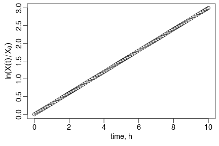
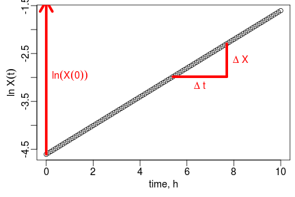
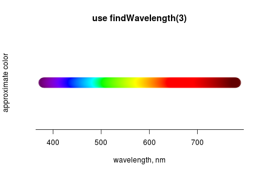
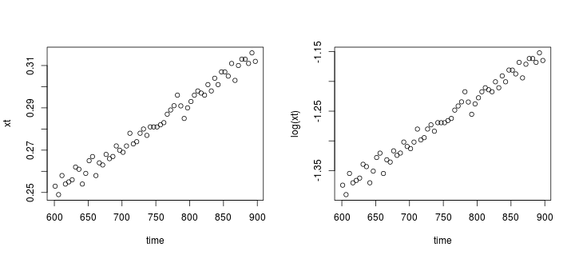
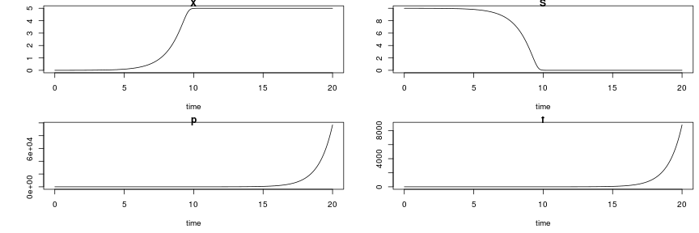
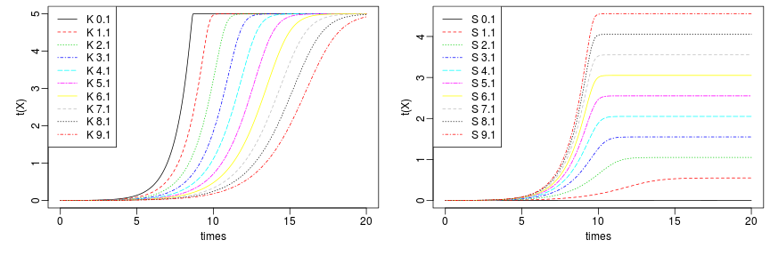

## From Data Hell to Model Heaven : Why Platereader?

### Tube vs. Platereader Cultures

1. Data Analysis
    * many replicates, many conditions
	* different statistics required
2. Endpoint vs. Kinetics
    * steady-state vs. dynamics

<oq>Are tube and platereader cultures comparable?</oq><br/>
<oq>Why (not)?</oq>

---
## From Data Hell to Model Heaven and back.
    
1. Inspect Data Files
    * Amend if required
2. Load & Inspect Data
    * Get overview, check data: roughly Ok?
	* Clean data: subtract blanks, cut time, rm outliers etc.
    * Inspect replicates: are observations replicated, 
	  what are our measurement errors?
4. Construct Your Analysis Pipeline
    * What do we need?
	* What were our assumptions, and are they justified?
	* Do we see additional unsuspected results?
5. Calculate Results & Statistics over Replicates

<oq> Do we have what we need for Monday?</oq>


---

### Installing R Packages from `cran`, `bioconductor` & `github`


```r
install.packages(c("grofit","growthcurver")) # at CRAN

source("https://bioconductor.org/biocLite.R") # at bioconductor
biocLite("cellGrowth")

install.packages("devtools") # R development tools
library(devtools)
install_github("raim/platexpress") # at github
```


https://github.com/raim/platexpress 

<oq>Do you speak `git`? Try to install from your local copy:</oq><br/>
`git clone git@github.com:raim/platexpress.git`<br/>
... and use `R CMD build` & `sudo R CMD INSTALL`

--- .centertext


### How to use a new R package?

```r
## load the package & explore
library(platexpress)

?platexpress # VIEW HELP FILES
vignette("platexpress") # READ THE VIGNETTE
demo("demo_ap12") # RUN THE DEMO
getData # SEE WHAT A FUNCTION DOES: just type without brackets

## APPLY TO YOUR DATA:
setwd("~/work/hhu_2015/uebung_201612/cellgrowth_20161214/praktikum_201612/test2/")
plate <- readPlateMap("161130_Praktikum_RAJ11_Test_2_layout.csv")
files <- c("161130_Praktikum_RAJ11_Test_2.csv")
raw <- readPlateData(files, type="Synergy",skip=44,sep=";",
                     time.format="%H:%M:%S",time.conversion=1/3600)
viewPlate(raw)
```

---&twocolbigright

### Why Growth Rates? 

***=left


* Injection of IPTG into one column (7 wells + 1 blank) every
100 minutes.
* Slower response with later injections.

***=right


\( \Rightarrow \) Faster growth rate \(\mu\) with later or no induction.

---&twocolbigright

### Why Growth Rates? 

***=left


* Injection of IPTG into one column (7 wells + 1 blank) every
100 minutes.
* Slower response with later injections.

***=right


\( \Rightarrow \) Faster growth rate \(\mu\) with later or no induction.

<oq>\(\mu = k \frac{\text{ribosomes}}{\text{proteins}}\)</oq>

<div  style='text-align: left;line-height: 90%;'><font size=3> 
Schaechter, Maaloe & Kjeldgaard, J Gen Microbiol <b> 1958</b>: <em>Dependency on medium and temperature of cell size and chemical composition during <oq>balanced growth</oq> of *Salmonella typhimurium*.</em><br/>
<b>Koch, Can J Microbiol 1988: <em>Why can't a cell grow infinitely fast?</em></b></br>
Neidhardt, J Bacteriol 1999: <em>Bacterial growth: constant obsession with dN/dt.</em>
</font>

---&twocolbigright

### Why Growth Rates? 

***=left


***=right
<oq>\(\mu = k \frac{\text{ribosomes}}{\text{proteins}}\)</oq>

<div  style='text-align: left;line-height: 90%;'><font size=3> 
Brauer <em>et al.</em>, Mol Biol Cell 2008: <em>Coordination of growth rate, cell cycle, stress response, and metabolic activity in yeast.</em><br/>
Slavov <em>et al.</em>, Mol Biol Cell 2011: <em>Coupling among growth rate response, metabolic cycle, and cell division cycle in yeast.</em><br/>
Scott <em>et al.</em>, Science 2010: <em>Interdependence of cell growth and gene expression: origins and consequences.</em></br>
Wei&szlig;e <em>et al.</em>, PNAS 2015: <em>Mechanistic links between cellular trade-offs, gene expression, and growth.</em>
</font></div>

---&twocolbigright


***=left


Scott *et al.*, Mol Syst Biol 2014: *Emergence of robust growth laws from optimal regulation of ribosome synthesis.*

***=right
<br/>
<oq>Expression of large gene groups correlates with \(\mu\).</oq>

<br/>
<oq>Even at constant \(\mu\) cells are not 
in steady-state!</oq>

Slavov *et al.*, Cell Rep 2014: *Constant growth rate can be supported by decreasing energy flux and increasing aerobic glycolysis.*<br/>

The concept of "balanced growth" is flawed, yet a central assumption
of many quantitative models.


---
### Cited at Wikipedia:


. . . that's how important it is (or perhaps it was his dad :p ).</br>

[1] Slavov *et al.*, Cell Rep 2014: *Constant growth rate can be supported by<br/>decreasing energy flux and increasing aerobic glycolysis.*<br/>

---
### DNA Supercoiling Varies during Exponential Phase (constant \(\mu\)).


Interested in a bachelor/master project? 

* Working on `platexpress` and/or quantitative models of growth vs. gene expression.
* At the interface of three projects: Ribonets, Coil-seq & Yeast Oscillations.

Fulcrand *et al.*, Sci Rep 2016: *DNA supercoiling, a critical signal<br/>regulating the basal expression of the lac operon in Escherichia coli.*

---
### DNA Supercoiling Varies during Exponential Phase (constant \(\mu\)).

 \(\Leftarrow \) &copy; Kai, today

Interested in a bachelor/master project? 

* Working on `platexpress` and/or quantitative models of growth vs. gene expression.
* At the interface of three projects: Ribonets, Coil-seq & Yeast Oscillations.

Fulcrand *et al.*, Sci Rep 2016: *DNA supercoiling, a critical signal<br/>regulating the basal expression of the lac operon in Escherichia coli.*

--- &twocol .codefont

### Growth & Gene Expression in *E. coli* : exponential growth

*** =left


$$latex 
\begin{equation*} \begin{aligned}  
\frac{\text{d}X(t)}{\text{d}t} =& \mu X(t)\\ 
X(t) =& X(0)   e^{\mu  t}\\ 
\end{aligned} \end{equation*} $$

<oq>Can you derive the formula<br/>for exponential growth?</oq>

*** =right


```r
time <- seq(0,10,0.1) # hours
mu <- 0.3 # specific growth rate, hour^-1
x0 <- 0.01 # the inoculum: cell density, cells liter^-1
xt <- x0 * exp(mu*time)
par(mai=c(.75,.75,.1,.1),mgp=c(1.5,.5,0),cex=1.2)
plot(time, xt,
     xlab="time, h",ylab=expression(X[0]*e^(mu*t)))
```


--- &twocol .codefont

### Growth & Gene Expression in *E. coli* : growth rate

*** =left


$$latex 
\begin{equation*} \begin{aligned}  
\frac{\text{d}X(t)}{\text{d}t} =& \mu X(t)\\ 
X(t) =& X(0)   e^{\mu  t}\\ 
\ln \frac{X(t)}{X(0)} =& \mu t
\end{aligned} \end{equation*} $$

<oq>Which important parameter <br/>can we calculate from here?</oq>

*** =right


```r
time <- seq(0,10,0.1) # hours
mu <- 0.3 # specific growth rate, hour^-1
x0 <- 0.01 # the inoculum: cell density, cells liter^-1
xt <- x0 * exp(mu*time)
par(mai=c(.75,.75,.1,.1),mgp=c(1.5,.5,0),cex=1.2)
plot(time, log(xt/x0),
     xlab="time, h",ylab=expression(ln(X(t)/X[0])))
```


--- &twocol .codefont

### Growth & Gene Expression in *E. coli* : doubling time

*** =left


$$latex 
\begin{equation*} \begin{aligned}  
\frac{\text{d}X(t)}{\text{d}t} =& \mu X(t)\\ 
X(t) =& X(0)   e^{\mu  t}\\ 
\frac{\ln 2}{\mu} = & t_D
\end{aligned} \end{equation*} $$

<oq>\(t_D\) is the average CULTURE doubling time.<br/>
In which cases is it also the average CELL doubling time?</oq>


*** =right


```r
time <- seq(0,10,0.1) # hours
mu <- 0.3 # specific growth rate, hour^-1
x0 <- 0.01 # the inoculum: cell density, cells liter^-1
xt <- x0 * exp(mu*time)
par(mai=c(.75,.75,.1,.1),mgp=c(1.5,.5,0),cex=1.2)
plot(time, log(xt/x0),
     xlab="time, h",ylab=expression(ln(X(t)/X[0])))
```



--- &twocolbigright .codefont

### Growth & Gene Expression in *E. coli* : growth rate

*** =left


$$latex 
\begin{equation*} \begin{aligned}  
\frac{\text{d}X(t)}{\text{d}t} =& \mu X(t)\\ 
X(t) =& X(0)   e^{\mu  t}\\ 
\ln(X(t)) =& \mu t + \ln(X(0))
\end{aligned} \end{equation*} $$

*** =right


```r
par(mai=c(.75,.75,.1,.1),mgp=c(1.5,.5,0),cex=1.2)
plot(time, log(xt), xlab="time, h",ylab=expression(ln~X(t)))
x1 <- .05; idx1 <- which(abs(xt-x1)==min(abs(xt-x1)))
x2 <- .1; idx2 <- which(abs(xt-x2)==min(abs(xt-x2)))
lines(x=time[c(idx1,idx2)], y=log(xt[c(idx1,idx1)]),col=2,lwd=5)
text(time[idx2],mean(log(xt[c(idx1,idx2)])),expression(Delta~X),pos=4,col=2)
lines(x=time[c(idx2,idx2)], y=log(xt[c(idx1,idx2)]),col=2,lwd=5)
text(mean(time[c(idx1,idx2)]),log(xt[idx1]),expression(Delta~t),pos=1,col=2)
arrows(x0=0,x1=0,y0=log(xt[1]),y1=-1.4,col=2,lwd=5);
text(x=0,y=-3,expression(ln(X(0))),pos=4,col=2)
```




---.codefont
### Load Your Data

```r
library(platexpress)

dpath <- "~/work/hhu_2015/uebung_201612/Praktikum-M4452_20161207/ecoli_ts_20161014"

plate <-readPlateMap(file.path(dpath,"20161014_platemap.csv"), fsep=";",
                     fields=c("strain","IPTG","blank"))
```

```
## Warning in file(file, "rt"): cannot open file '/home/
## raim/work/hhu_2015/uebung_201612/Praktikum-M4452_20161207/
## ecoli_ts_20161014/20161014_platemap.csv': No such file or directory
```

```
## Error in file(file, "rt"): cannot open the connection
```

```r
files <- c("20161014_20161014 IPTG mVenus Injection  1_Absorbance.CSV",
           "20161014_20161014 IPTG mVenus Injection  1_Fluorescence.CSV")
raw <- readPlateData(file.path(dpath,files), type="BMG", time.conversion=1/60)
```

```
## Parsing file ~/work/hhu_2015/uebung_201612/Praktikum-M4452_20161207/ecoli_ts_20161014/20161014_20161014 IPTG mVenus Injection  1_Absorbance.CSV
```

```
## Warning in file(file, "rt"): cannot open file '/home/raim/work/hhu_2015/
## uebung_201612/Praktikum-M4452_20161207/ecoli_ts_20161014/20161014_20161014
## IPTG mVenus Injection 1_Absorbance.CSV': No such file or directory
```

```
## Error in file(file, "rt"): cannot open the connection
```

<oq> What does the `warning` mean?<oq/>

---

```r
showSpectrum() # try: findWavelength(3)
```



```r
## re-name and color data
raw <- prettyData(raw, dids=c(OD="584",mVenus="485/Em520"),
                  colors=c("#000000",wavelength2RGB(600)))
```

```
## Error in data$mids: object of type 'closure' is not subsettable
```

---

```r
vp <- viewPlate(raw,xlim=c(0,1800),xscale=TRUE)
```

```
## Error in data$dataIDs: object of type 'closure' is not subsettable
```

---
### Linear and Non-linear Regression: analyzing a single data set


```r
## GET A SINGLE DATASET
od <- getData(raw,"OD") # what is `od` ?
```

```
## Error in data[[ID]]: object of type 'closure' is not subsettable
```

```r
TIME <- raw$Time        # what does the $ do?
```

```
## Error in raw$Time: object of type 'closure' is not subsettable
```

```r
Xt <- od[,"A8"]
```

```
## Error in eval(expr, envir, enclos): object 'od' not found
```

```r
plot(TIME, Xt)
```

```
## Error in plot(TIME, Xt): object 'TIME' not found
```

---

```r
## cut to growth range
rng <- TIME<1500   # what is `rng` ?
```

```
## Error in eval(expr, envir, enclos): object 'TIME' not found
```

```r
Xt <- Xt[rng]
```

```
## Error in eval(expr, envir, enclos): object 'Xt' not found
```

```r
TIME <- TIME[rng]
```

```
## Error in eval(expr, envir, enclos): object 'TIME' not found
```

```r
## look at data
par(mfcol=c(1,2), mai=c(.75,.75,.1,.1), mgp=c(1.5,.5,0), cex=1.2)
plot(TIME, Xt)
```

```
## Error in plot(TIME, Xt): object 'TIME' not found
```

```r
plot(TIME, log(Xt)) # log it - default `log` in R is the natural logarithm, ln
```

```
## Error in plot(TIME, log(Xt)): object 'TIME' not found
```

---

```r
## cut to linear range of growth
rng <- TIME>600 & TIME < 900
```

```
## Error in eval(expr, envir, enclos): object 'TIME' not found
```

```r
xt <- Xt[rng]
```

```
## Error in eval(expr, envir, enclos): object 'Xt' not found
```

```r
time <- TIME[rng]
```

```
## Error in eval(expr, envir, enclos): object 'TIME' not found
```

```r
## look again at data
par(mfcol=c(1,2))
plot(time, xt)
plot(time, log(xt))
```



---.codefont


```r
## DO LINEAR REGRESSION
## ln(X(t)) = mu * t + ln(X(0))
lfit <- lm(log(xt) ~ time) # what is `~` ?

## check quality of fit
summary(lfit)
```

```
## Warning in summary.lm(lfit): essentially perfect fit: summary may be
## unreliable
```

```
## 
## Call:
## lm(formula = log(xt) ~ time)
## 
## Residuals:
##        Min         1Q     Median         3Q        Max 
## -1.207e-14 -1.196e-16  1.336e-16  3.636e-16  1.065e-15 
## 
## Coefficients:
##               Estimate Std. Error    t value Pr(>|t|)    
## (Intercept) -4.605e+00  2.679e-16 -1.719e+16   <2e-16 ***
## time         3.000e-01  4.628e-17  6.482e+15   <2e-16 ***
## ---
## Signif. codes:  0 '***' 0.001 '**' 0.01 '*' 0.05 '.' 0.1 ' ' 1
## 
## Residual standard error: 1.356e-15 on 99 degrees of freedom
## Multiple R-squared:      1,	Adjusted R-squared:      1 
## F-statistic: 4.202e+31 on 1 and 99 DF,  p-value: < 2.2e-16
```

---

```r
## get parameters from linear regression
x0.1 <- exp(coefficients(lfit)[1]) # e^ln(X(0)) = ?
mu.1 <- coefficients(lfit)[2] # mu

## plot
par(mai=c(.75,.75,.1,.1),mgp=c(1.5,.5,0),cex=1.2)
plot(TIME,log(Xt))
```

```
## Error in plot(TIME, log(Xt)): object 'TIME' not found
```

```r
lines(TIME, mu.1*TIME + log(x0.1), col="red")
```

```
## Error in lines(TIME, mu.1 * TIME + log(x0.1), col = "red"): object 'TIME' not found
```

---.codefont

```r
## DO NON-LINEAR REGRESSION, using
## the results of the linear fit as initial parameter guesses
dat <- data.frame(time=time, xt=xt)
start <- list(mu=mu.1,x0=x0.1)
nlfit <- nls(xt ~ x0*exp(mu*time),data=dat,start=start) # TRY MORE COMPLEX MODELS, see a few slides ahead
```

```
## Error in nls(xt ~ x0 * exp(mu * time), data = dat, start = start): number of iterations exceeded maximum of 50
```

```r
## check quality of fit
summary(nlfit)
```

```
## Error in summary(nlfit): object 'nlfit' not found
```

---.codefont

```r
## get parameters & plot results
mu.2 <- coefficients(nlfit)[1]
```

```
## Error in coefficients(nlfit): object 'nlfit' not found
```

```r
x0.2 <- coefficients(nlfit)[2]
```

```
## Error in coefficients(nlfit): object 'nlfit' not found
```

```r
par(mfcol=c(1,2),mai=c(.75,.75,.1,.1),mgp=c(1.5,.5,0),cex=1.2)
plot(TIME,Xt,ylim=c(0.2,.4))
```

```
## Error in plot(TIME, Xt, ylim = c(0.2, 0.4)): object 'TIME' not found
```

```r
lines(TIME, x0.2 * exp(TIME*mu.2),col="green", lty=2,lwd=5)
```

```
## Error in lines(TIME, x0.2 * exp(TIME * mu.2), col = "green", lty = 2, : object 'TIME' not found
```

```r
lines(TIME, x0.1 * exp(TIME*mu.1),col="red",lwd=2)
```

```
## Error in lines(TIME, x0.1 * exp(TIME * mu.1), col = "red", lwd = 2): object 'TIME' not found
```

```r
legend("bottomright",legend=c("data","lin.reg.","non-lin."),
       col=c(1,2,3),pch=c(1,NA,NA),lty=c(NA,1,2),lwd=3)
```

```
## Error in strwidth(legend, units = "user", cex = cex, font = text.font): plot.new has not been called yet
```

```r
plot(TIME, x0.2 * exp(TIME*mu.2),col="green", lty=2,lwd=5)
```

```
## Error in plot(TIME, x0.2 * exp(TIME * mu.2), col = "green", lty = 2, lwd = 5): object 'TIME' not found
```

```r
points(TIME,Xt)
```

```
## Error in points(TIME, Xt): object 'TIME' not found
```

```r
lines(TIME, x0.1 * exp(TIME*mu.1),col="red",lwd=2)
```

```
## Error in lines(TIME, x0.1 * exp(TIME * mu.1), col = "red", lwd = 2): object 'TIME' not found
```

<oq>How many linear phases can you detect in your experiments? Why are there several?</oq>

---&twocol

### Fitting Growth Models

***=left


* Initial Cell Density: \(X(0) \)
* Lag Phase: \(\lambda \)
* Exponential Phase: growth rate \(\mu \)
* Stationary Phase: *capacity* \(A \) 

https://cran.r-project.org/package=grofit

***=right

* Logistic Equation:<br/>
\(X(t) = \frac{A}{1+e^{\frac{4 \mu}{A}(\lambda - t)+2}} \)
* Gompertz:<br/>
\(X(t) = A e^{-e^{\frac{\mu e}{A}(\lambda -t)+1}} \)
* Modified Gompertz:<br/>
\(X(t) = A e^{-e^{\frac{\mu e}{A}(\lambda -t)+1}} + A e^{\alpha(t-t_{shift})} \)
* Richard's generalized logistic model:<br/> \(  X(t) = A (1 + \nu e^{1+ \nu + \frac{\mu}{A}(1+\nu )^{1+\frac{1}{\nu}}(\lambda -t)})^{-\frac{1}{\nu}} \)

as implemented in R package `grofit`

<oq> Try these equations with `nls`.<oq/><br/>
<oq> Do we need packages if `nls` works well?<oq/>

---
### Prepare Data: blanks, cuts, etc.


```r
raw2 <- cutData(raw, rng=c(0,1550), mid="Time")
```

```
## Error in data[[mid]]: object of type 'closure' is not subsettable
```

```r
raw3 <- correctBlanks(raw2, plate,dids="OD",max.mid=1500) 
```

```
## Error in correctBlanks(raw2, plate, dids = "OD", max.mid = 1500): object 'raw2' not found
```

```r
raw4 <- correctBlanks(raw3,plate,dids="mVenus",by=c("strain","IPTG"),
                      mbins=length(raw$Time)/5,verb=FALSE)
```

```
## Error in correctBlanks(raw3, plate, dids = "mVenus", by = c("strain", : object 'raw3' not found
```

```r
data <- adjustBase(raw4, base=0, add.fraction=.001, 
                   wells=unlist(groups),xlim=c(1,which(raw$Time>1500)[1]),
				   each=TRUE, verb=FALSE) # set verb to TRUE
```

```
## Error in adjustBase(raw4, base = 0, add.fraction = 0.001, wells = unlist(groups), : unused argument (wells = unlist(groups))
```
<oq> What happens in `correctBlanks` and `cutData`? <br/>
What does `adjustBase` do, and when could we need it?<p/>

---
### Get Replicate Groups


```r
groups <- getGroups(plate, c("strain"), verb=FALSE) # SET TO TRUE!
```

```
## Error in lapply(plate, function(x) as.character(x)): object 'plate' not found
```

```r
groups2 <- getGroups(plate, c("strain","IPTG"), verb=FALSE) 
```

```
## Error in lapply(plate, function(x) as.character(x)): object 'plate' not found
```

```r
viewGroups(data, groups=groups, groups2=groups2, verb=FALSE)
```

```
## Error in unlist(groups): object 'groups' not found
```

<oq> What are the lines and areas?<br/>
What is the structure of the `groups` item? 
Can you make your own groupings?<br/>
Try different groupings and parameters to `viewGroups`.</oq>

---
### Use Package `grofit` to Fit Growth Data


```r
raw2 <- cutData(raw,rng=c(200,1500))
```

```
## Error in data$mids: object of type 'closure' is not subsettable
```

```r
grodat <- data2grofit(raw2, did="OD", plate=plate, 
                      wells=groups[["pUC18mV"]])
```

```
## Error in data2grofit(raw2, did = "OD", plate = plate, wells = groups[["pUC18mV"]]): object 'raw2' not found
```

```r
library(grofit)
fitparams <- grofit.2.control(interactive=FALSE, plot=TRUE) # SET ALL TO TRUE!!
pdf("growthrates.pdf")
fits <- gcFit.2(time=grodat$time, data=grodat$data, control=fitparams)
```

```
## Error in gcFit.2(time = grodat$time, data = grodat$data, control = fitparams): object 'grodat' not found
```

```r
dev.off()
```

```
## png 
##   2
```

---
### Use Package `grofit` to Fit Growth Data


```r
table <- grofitGetParameters(fits, p=c("AddId","mu.spline"))
```

```
## Error in grofitGetParameters(fits, p = c("AddId", "mu.spline")): object 'fits' not found
```

```r
boxplot(table[,"mu.spline"] ~ table[,"AddId"], las=2, ylim=c(1.9e-4,5e-4))
```

```
## Error in table[, "mu.spline"]: object of type 'closure' is not subsettable
```

<oq> 
Try different well groups instead of `table[,"AddId"]`.<br/>
Are the fits Ok? How to get more information on the fits?</oq>

---&twocol

***=left
### Gene Expression

* Measured: total fluorescence per well
* Wanted: protein level per cell!

Assumptions:

1. Fluorescence is linear with protein level
2. OD is linear with cell number

<oq>\( \Rightarrow \) Fluor./OD  &Tilde; proteins/cell</oq>

***=right


---
### Gene Expression: Normalized Fluorescence - FL/OD


```r
viewGroups(data, groups=groups, groups2=groups2, xid="OD", lwd.orig=.5, verb=FALSE)
```

```
## Error in unlist(groups): object 'groups' not found
```

---
### Gene Expression: Normalized Fluorescence  - FL/OD


```r
fl <- getData(data,"mVenus")
```

```
## Error in data[[ID]]: object of type 'closure' is not subsettable
```

```r
od <- getData(data,"OD")
```

```
## Error in data[[ID]]: object of type 'closure' is not subsettable
```

```r
data <- addData(data, ID="mV/OD", dat=fl/od, col="#0095FF")
```

```
## Error in data$dataIDs: object of type 'closure' is not subsettable
```

```r
viewGroups(data, groups=groups, groups2=groups2, 
           dids=c("OD","mV/OD"),ylims=list("mV/OD"=c(0,1e4)),emphasize.mean=T,verb=F)
```

```
## Error in unlist(groups): object 'groups' not found
```

---
### Gene Expression: Normalized Fluorescence - FL/OD


```r
viewGroups(data, groups=groups, groups2=groups2, dids="mV/OD", xid="OD", lwd.orig=.5, 
           ylim=c(0,1e4), g2.legend=FALSE, verb=FALSE)
```

```
## Error in unlist(groups): object 'groups' not found
```

<oq>What could the slope \(\frac{mV}{OD} \sim OD \) (where it's linear) 
mean?<br/>Can we use it?</oq>

---
### Gene Expression: Normalized Fluorescence - Interpolate to OD


```r
od.data <- interpolatePlateData(data,"OD")
```

```
## Error in data$dataIDs: object of type 'closure' is not subsettable
```

```r
viewGroups(od.data, groups=groups[2], groups2=groups2,xlim=c(.01,.15),
           ylims=list("mV/OD"=c(0,1e4)),dids="mV/OD", show.ci=F,lwd.orig=0, verb=F)
```

```
## Error in unlist(groups): object 'groups' not found
```

<oq>Can we smooth upstream data to get rid of the noise?</oq>

---
### Gene Expression: The Fold Change


```r
flod <- getData(od.data,"mV/OD")
```

```
## Error in getData(od.data, "mV/OD"): object 'od.data' not found
```

```r
uninduced <- rowMeans(flod[, groups2[["pUC18mV_Inj:NA"]]],na.rm=TRUE)
```

```
## Error in is.data.frame(x): object 'flod' not found
```

```r
od.data <- addData(od.data, ID="mV/OD/uninduced", dat=flod/uninduced, col="#AAAA00")
```

```
## Error in match(x, table, nomatch = 0L): object 'od.data' not found
```

```
## Error in unlist(groups): object 'groups' not found
```

---
### Gene Expression: Data Normalization


```
## Error in unlist(groups): object 'groups' not found
```

```
## Error in unlist(groups): object 'groups' not found
```

```
## Error in data[[ID]]: object of type 'closure' is not subsettable
```

```
## Error in is.data.frame(x): object 'flod' not found
```

```
## Error in data$dataIDs: object of type 'closure' is not subsettable
```

```
## Error in unlist(groups): object 'groups' not found
```

```
## Error in unlist(groups): object 'groups' not found
```

<oq>What's wrong with `mV/OD/uninduced` vs. `time` w/o interpolation?</oq>


---
### Gene Expression: Data Normalization - Result


```r
results <- boxData(od.data, did="mV/OD/uninduced", rng=.08, groups=groups2, type="bar")
```

```
## Error in boxData(od.data, did = "mV/OD/uninduced", rng = 0.08, groups = groups2, : object 'od.data' not found
```

Extracts values in given range; plots by groups, and returns
values for each well. 

<oq>What are the error bars?<br/>
See `?cutData` on how to obtain values in 
a given range directly.<br/>Or try yourself with base R.</oq>

---
### Gene Expression: Data Normalization - Result


```r
library(platexpress)
head(results)
```

```
## Error in head(results): object 'results' not found
```
<oq>Calculate confidence intervals and error bars yourself.</oq>

---.codefont


```r
imgtxt <- matrix(results[,1], nrow=7, ncol=12) # MATRIX THAT LOOKS LIKE PLATE
```

```
## Error in matrix(results[, 1], nrow = 7, ncol = 12): object 'results' not found
```

```r
imgdat <- matrix(results[,3], nrow=7, ncol=12)
```

```
## Error in matrix(results[, 3], nrow = 7, ncol = 12): object 'results' not found
```

```r
tmp <- t(apply(imgdat, 2, rev)) # WHAT HAPPENS HERE?
```

```
## Error in apply(imgdat, 2, rev): object 'imgdat' not found
```

```r
par(mai=c(.5,.5,.01,.01))
image(x=1:12, y=1:7, z=log(tmp), axes=FALSE, ylab=NA, xlab=NA)
```

```
## Error in image.default(x = 1:12, y = 1:7, z = log(tmp), axes = FALSE, : object 'tmp' not found
```

```r
text(x=rep(1:12,7), y=rep(7:1,each=12), paste(t(imgtxt),":\n",t(round(imgdat,2)))) 
```

```
## Error in t(imgtxt): object 'imgtxt' not found
```

```r
axis(1,at=1:12); axis(2, at=1:7, labels=toupper(letters[7:1]), las=2)
```

```
## Error in axis(1, at = 1:12): plot.new has not been called yet
```

```
## Error in axis(2, at = 1:7, labels = toupper(letters[7:1]), las = 2): plot.new has not been called yet
```

<oq>In which order does `image` plot rows and columns of a matrix?</oq><br/> 
<oq>Can you spot any systematic plate effects?</oq>

<br/><br/>hide:
pixels in the first row, from left to right,<br/> 
correspond to the first column in the matrix, bottom up

---
### Gene Expression - Summary

1. Growth rate \( \mu \) matters!
1. Fluorescence per OD as a measure of proteins per cell.
    * Note noise accumulation at low values. <oq>Why?</oq>
3. Interpolate data to a common OD.
4. Calculate fold-ratio to control.
    * Be careful; what is your control?
4. Get data at a given OD, or search maximum, etc.

<br/>
<oq>What other measures would be interesting or<br/>could be
required for a quantitative model?</oq>

---.centertext
## From Wells to Cells

### Conversion of Carbon&Energy Source S to biomass X:

S \(\rightarrow\) y X + (1-y) P

<oq>What are substrate S and product P in our experiments?</oq>

### Catalyzed by X:

$$latex
\begin{equation}
  \label{apeq:monod}
  \begin{aligned}
    \frac{\text{d}X}{\text{d}t} &= \mu X\\
    \frac{\text{d}S}{\text{d}t} &= - \frac{1}{y} \mu X \\
    \mu & =\mu_{max}\frac{S}{S+K}
    %\mu &= f(S)
  \end{aligned}
\end{equation}
$$

<oq>How can we estimate the yield \(y\) ?</oq> <oq>Does \(y\) have units? Which?</oq><br/>
<oq>What is the steady state of the system?</oq>


--- .centertext
## From Wells to Cells

### Continuous Culture - Dilution Rate \(\; \phi\)

$$latex
\begin{equation}
  \label{apeq:monod2}
  \begin{aligned}
    \frac{\text{d}X}{\text{d}t} &= (\mu-\phi) X\\
    \frac{\text{d}S}{\text{d}t} &= (S_{in}-S)\phi - \frac{1}{y} \mu X \\
    \mu & =\mu_{max}\frac{S}{S+K}
    %\mu &= f(S)
  \end{aligned}
\end{equation}
$$


<oq>What is the steady state of above system?<br/>
What is the feedback structure of growth?<br/>
Can above system show more complex dynamics, such as<br/>
oscillations or multistablity?</oq>


---.codefont
## From Wells to Cells: Growth

### Fluorescent Protein F, total culture concentration:
$$latex
\begin{equation}
  \label{eq:Protein}
  \begin{aligned}
%  \frac{\text{d} F}{\text{d} t} = k X V_c - d F
    \frac{\text{d}X}{\text{d}t} &= \mu X\\
  \frac{\text{d} F}{\text{d} t} &= K(?) - \delta F
  \end{aligned}
\end{equation}
$$

### Intracellular concentration:

$$latex
\begin{equation}
f = \frac{F}{X V_c}
\end{equation}
$$

<br/> <oq>What is \(K\), must be \(\sim X\), right ?</br>How can we
map \(F\) from total culture to intracellular concentration \(f\)
?<br/> Calculate \(\frac{\text{d} f}{\text{d} t}\).</oq>

---.codefont 
## From Wells to Cells : Growth

$$latex
\begin{equation}
  \begin{aligned}
    f =& \frac{F}{X V_c} \;;\; v_f=X V_c\\
    \dot{f} =& \dot{F}\frac{1}{X V_c} - \dot{X}\frac{F}{X}\frac{1}{X V_c}\\
            =& \dot{F}\frac{1}{v_f} - \dot{X}\frac{F}{X}\frac{1}{v_f}\\
            =& (K - \delta f\,v_f)\frac{1}{v_f} - \mu X \frac{f v_f}{X} \frac{1}{v_f}\\
            =& \frac{K}{v_f} - (\delta + \mu)f\\
          K =& k X V_c
  \end{aligned}
\end{equation}
$$

<oq>What is \(X V_c\) ?</oq><br/>
<oq>Note the term \(\delta + \mu\) . What is it, and where did the \(\mu\) come from?</oq>

---.codefont
## From Wells to Cells : Growth

$$latex
\begin{equation}
  \label{apeq:wellmodel}
  \begin{aligned}
    \frac{\text{d}X}{\text{d}t} &= \mu X\\
    \frac{\text{d}S}{\text{d}t} &= - \frac{1}{y} \mu X\\
    \frac{\text{d}f}{\text{d}t} &= k - (\delta+\mu)f
  \end{aligned}
\end{equation}
$$

<br/>
 
* <oq>Add activation of $f$ production by an inducer and
modulation by a riboswitch $r$.</oq>
* <oq>Add expression of both from a plasmid
(which itself increases exponentially within cells).</oq> 
* <oq>And how could we account for
the effect of induced gene expression on growth rate?</oq>

<oq>. . . and find appropriate parameters (back in data hell),<br/> 
start e.g. at `bionumbers`.</oq>

---

Parameter|Unit|Value|Description|Source
---|---|---|---|---
\(y\) | g DCW / g glucose | 0.5 | yield factor \(\ \frac{\Delta X}{- \Delta S} \)| [bionumbers](http://bionumbers.hms.harvard.edu/bionumber.aspx?&id=105318&ver=3) 
\(V_c\)| &mu;m<sup>3</sup> | 1 | average cell volume | [bionumbers](http://bionumbers.hms.harvard.edu/bionumber.aspx?id=101788)
\(C_c\)| fg/&mu;m<sup>3</sup> | 242&#8723;43 | cell carbon content | [bionumbers](http://bionumbers.hms.harvard.edu/bionumber.aspx?&id=106619)
DCW/OD | (g/L)/OD | 0.36 | g DCW per OD600  | [bionumbers](http://bionumbers.hms.harvard.edu/bionumber.aspx?&id=109837)
cells/OD| (cells/mL)/OD| 5.9-21 1e8 | cells per OD600 | [bionumbers]()
\(\mu_{max}\)| 1/h | | maximal growth rate | estimate from exponential phase
\(K\) | mol/L | | \(S\) where \(\mu = \mu_{max}/2 \) | estimate from data
\(k\) | mol/(L*h)| | protein expression rate| search literature/databases
\(\delta\) | 1/h | | protein degradation rate | search literature/databases

---.codefont
## From Wells to Cells : Riboswitch

$$latex \scriptsize
\begin{equation}
  \label{apeq:riboswitch}
  \begin{aligned}
    \frac{\text{d}sRNA}{\text{d}t} &= C P_{s} (TetR, aTc) - (\mu + \delta_s)sRNA\\
    \frac{\text{d}mRNA}{\text{d}t} &= C P_{m} ( LacI,IPTG) - (\mu + \delta_m)mRNA\\
    \frac{\text{d}GFP}{\text{d}t} &= (r_0 mRNA + r_1 sRNA::mRNA)\frac{m}{m+\mu+\delta_g} - (\mu + \delta_g)GFP
  \end{aligned}
\end{equation}
$$

with transcriptional activities:

$$latex \tiny
\begin{equation}
  \label{apeq:transcription}
  \begin{aligned}
  P_m(LacI, IPTG) &= P_m^0 \frac{1+\frac{1}{f_{lac}}(\frac{LacI}{K_{lac}(1+\frac{IPTG}{K_{IPTG}})})^{n_{lac}}}{1+(\frac{LacI}{K_{lac}(1+\frac{IPTG}{K_{IPTG}})})^{n_{lac}}}\\
  P_s(TetR,aTc) &= P_s^0 \frac{1+\frac{1}{f_{tet}}(\frac{TetR}{K_{tet}(1+\frac{aTc}{K_{aTc}})})^{n_{tet}}}{1+(\frac{TetR}{K_{tet}(1+\frac{aTc}{K_{aTc}})})^{n_{tet}}}\\
  \end{aligned}
\end{equation}
$$

<oq>What and where is sRNA::mRNA?</oq><br/>
<oq>What are all the parameters?</oq> <oq>Can you derive equations for the steady state?</oq>

---
## From Wells to Cells : Riboswitch


Rodrigo *et al.* 2012 - Steady State Solution:

$$latex \scriptsize
\begin{equation}
  \label{apeq:steadystate}
  GFP_{ss}(IPTG, aTc) = F_0 \frac{1 + f_1(\frac{IPTG}{K_1})^{n_{1}} + f_2(\frac{aTc}{K_2})^{n_{2}} + f_1 f_{sRNA}(\frac{IPTG}{K_1})^{n_{1}}(\frac{aTc}{K_2})^{n_{2}} }{1 + (\frac{IPTG}{K_1})^{n_{1}} + (\frac{aTc}{K_2})^{n_{2}} + (\frac{IPTG}{K_1})^{n_{1}}(\frac{aTc}{K_2})^{n_{2}}}
\end{equation}
$$

<br/>

<oq>What are these parameters>? See Supplement of Rodrigo <em>et al.</em> 
2012</oq>

<oq>Plot this function in `R` or `python`, using the<br/> concentration ranges 
in your experiments: can you use `image`? Can `R` do 3D plots?</oq>


<oq>Is the steady state assumption justified? Can we combine it with our cell growth model?</oq>


---
### Model


```r
## Chaos in the atmosphere
growth <- function(t, state, parameters) {
    with(as.list(c(state, parameters)), {
        #y  <- a*S + b # variable yield, Heinzle et al. 1983
        mu <- mu_max*S/(S+K) 
        dX <-  mu*X
        dS <-  - mu*X/y
        dp <- (mu.p - mu) * p
        df <- p*k - (d+mu)*f
        list(c(dX, dS, dp, df))
    })
}
```

---

### Solve

```r
library(deSolve)

parameters <- c(mu_max = 1, K = 1, mu.p = 1, k = .1, d=.1, y=0.5)#, a=1, b=-1)
state      <- c(X = 0.001, S = 10, p = 1, f = 0)
times      <- seq(0, 20, by = 0.01)

out <- ode(y = state, times = times, func = growth, parms = parameters)

par(mai=c(.75,.75,.1,.1))
plot(out)
```




---
### Vary Parameters & Initial Conditions

```r
ode.scan <- function(id, val) {
    outs <- rep(list(NA),length(val))
    for ( i in 1:length(val) ) {
        if ( id %in% names(parameters) )
            parameters[id] <- val[i]
        if ( id %in% names(state) )
            state[id] <- val[i]
        outs[[i]] <- ode(y = state, times = times, func = growth,
                         parms = parameters)
    }
    outs
}
```

---.codefont
### Vary Parameters & Initial Conditions

```r
par(mfcol=c(1,2),mai=c(.75,.75,.1,.1),mgp=c(1.7,.5,0))
outs <- ode.scan("K",seq(0.1,10,1))
X <- matrix(unlist(lapply(outs, function(x) x[,"X"])), ncol = length(times), byrow = TRUE)
matplot(times,t(X),type="l",col=1:nrow(X),lty=1:nrow(X))
legend("topleft",paste("K",seq(0.1,10,1)),col=1:nrow(X),lty=1:nrow(X))

outs <- ode.scan("S",seq(0.1,10,1))
X <- matrix(unlist(lapply(outs, function(x) x[,"X"])), ncol = length(times), byrow = TRUE)
matplot(times,t(X),type="l",col=1:nrow(X),lty=1:nrow(X))
legend("topleft",paste("S",seq(0.1,10,1)),col=1:nrow(X),lty=1:nrow(X))
```



---
### Fit To Data

https://www.r-bloggers.com/learning-r-parameter-fitting-for-models-involving-differential-equations/

```r
library(FME)
```

```
## Loading required package: rootSolve
```

```
## Loading required package: coda
```
